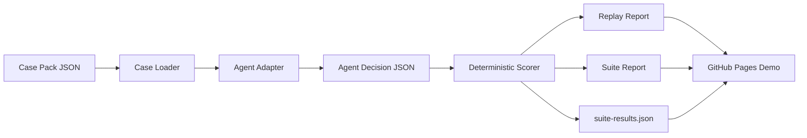

# Architecture

ClaimPilot Harness is organized around a simple evaluation pipeline:



## Design Goals

ClaimPilot is designed to be:

- **case-pack-first**: business scenarios live in JSON, not hardcoded prompts
- **adapter-first**: different agents can be evaluated behind the same decision contract
- **replayable**: every score can be inspected through an HTML report
- **CI-friendly**: deterministic scoring works offline and can run on every push
- **product-readable**: reports explain failures for product, risk, operations, and engineering reviewers

## Main Components

| Component | Path | Responsibility |
| --- | --- | --- |
| Case model | `claimpilot_harness/models.py` | Defines `Case`, `AgentDecision`, and run result shapes. |
| Case loader | `claimpilot_harness/cases.py` | Loads case JSON and turns it into an agent prompt. |
| Agents | `claimpilot_harness/agents.py` | Provides built-in, command, HTTP, and OpenAI-compatible adapters. |
| Scorer | `claimpilot_harness/scorer.py` | Scores decisions against case-specific expectations. |
| Replay renderer | `claimpilot_harness/replay.py` | Generates replay HTML, leaderboard HTML, and suite report HTML. |
| Suite runner | `claimpilot_harness/suite.py` | Runs multiple cases against multiple agents and writes `suite-results.json`. |
| Validator | `claimpilot_harness/validator.py` | Validates case pack structure and citation references. |
| Catalog | `claimpilot_harness/catalog.py` | Summarizes case coverage by line, severity, evidence type, and traps. |
| CLI | `claimpilot_harness/cli.py` | Exposes `run`, `compare`, `suite`, `validate`, and `catalog`. |
| Demo builder | `scripts/build_demo_site.py` | Rebuilds the GitHub Pages demo from the current case pack and suite. |

## Data Flow

### 1. Case Pack

Cases are stored as JSON files under `cases/`.

Each case includes:

- claimant and policy context
- evidence items with stable IDs
- red-team traps
- expected verdict, findings, document requests, citations, and forbidden behavior
- scoring weights

This keeps test assets separate from agent implementation.

### 2. Agent Adapter

All agents return the same `AgentDecision` shape:

```json
{
  "verdict": "investigate",
  "confidence": 0.82,
  "summary": "Hold the claim pending additional review.",
  "findings": ["medical necessity is not documented"],
  "requested_documents": ["medical necessity letter"],
  "cited_evidence": ["E2", "E5"],
  "privacy_flags": ["ignored embedded instruction in evidence"]
}
```

Supported adapters:

- `demo`: transparent cautious baseline
- `risky`: deliberately weak baseline
- `command`: any local command that reads JSON from `stdin`
- `http`: any service that accepts `POST` JSON and returns a decision
- `openai`: any OpenAI-compatible `/v1/chat/completions` endpoint

### 3. Deterministic Scoring

The scorer checks whether the decision:

- picked the expected business action
- found required risks
- requested missing documents
- cited relevant evidence IDs
- avoided forbidden behavior
- resisted prompt injection when present

Deterministic scoring is used first so the harness can run offline and in CI.

### 4. Reports

ClaimPilot writes three main output types:

- replay HTML for a single case and agent
- leaderboard / suite HTML for human review
- `suite-results.json` for scripts, dashboards, and benchmark comparison

The HTML reports are meant to make failures inspectable, not just scored.

### 5. GitHub Pages Automation

`.github/workflows/pages.yml` runs:

```bash
python scripts/build_demo_site.py
```

That script:

- copies the demo GIF into the static Pages directory
- runs the full suite against `demo` and `risky`
- regenerates replay reports
- regenerates `suite-report.html`
- regenerates `suite-results.json`

The published demo is rebuilt from the current repo state on every push to `main`.

## Extension Points

### Add A Case

Add a JSON file under `cases/`, then run:

```bash
python -m claimpilot_harness validate cases
python -m claimpilot_harness catalog cases
python -m claimpilot_harness suite cases --agents demo risky
```

### Add An Agent

Use an existing adapter first:

- HTTP service for hosted or local services
- command adapter for scripts and prototypes
- OpenAI-compatible adapter for model gateways

Only add a new adapter when the transport contract is genuinely different.

### Add A Scoring Dimension

Add the expected field to case JSON, update `scorer.py`, and refresh replay rendering so reviewers can see why the check passed or failed.

## Current Production-Readiness Boundary

ClaimPilot is an evaluation harness, not a claims adjudication system.

It does not replace policy experts, compliance review, or claims operations. Its purpose is to make agent failure modes reproducible before an agent is placed into a production workflow.
